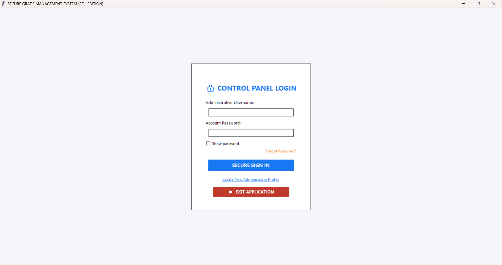

# ACADEMIC_MANAGEMENT_SYSTEM

# GROUP MEMBERS
- [Dela Torre, Kayea Joy] (https://github.com/KHAY2006)
- Inajenes, Nena Rose
- [Dela Torre, Kayea Joy](https://github.com/KHAY2006)
 # Section
 - IT1C

# Project Description
- In an era of increasing digital vulnerability, managing student grades shouldn't be a source of anxiety. The Secure Grade Management System is a professional-grade, locally-hosted solution designed to give you absolute control over your academic data. Unlike cloud-based platforms that store your sensitive information on remote servers, our system keeps your records strictly on your machine.

# Features
- Secure teacher/administrator registration with passwords hashed using PBKDF2-HMAC-SHA256 (unique salt per entry, 100,000 iterations).
- Login authentication against the local SQLite database.
- Account recovery via a security question, with a guided Forgot Password flow and password reset (with strength indicator).
- Class directory (folder) management per educational level: Elementary, High School, Senior High, and College.
- Student grade entry organized by semester segment and academic period (Prelim/Midterm/Final for college, quarterly for K-12).
- Automatic General Weighted Average (GWA) computation with PASSED / REMEDIAL / INCOMPLETE academic standing (college scale ≤ 3.0, K-12 scale ≥ 75).
- Tabular grade matrix view per class, with row deletion of student records.
- Data Privacy Policy & Terms of Use modal (compliant with RA 10173) with a required consent checkbox at registration.
- All data stored locally in a SQLite database file; no external/cloud transmission.

# Technologies and Libraries Used
- Python 3 (standard library only — no external packages required).
- Tkinter (`tkinter`, `ttk`, `messagebox`, `scrolledtext`) for the graphical user interface.
- `sqlite3` for local database storage.
- `hashlib` (PBKDF2-HMAC-SHA256) and `secrets` for secure password/answer hashing and salt generation.

# Installation Guide
- Install Python 3 (which includes Tkinter and the `sqlite3`, `hashlib`, and `secrets` modules used by this project).
- Download or clone this repository to your local machine.
- No additional libraries need to be installed — the project relies solely on the Python standard library.
- The SQLite database file (`secured_academic.db`) is created automatically on first run.

# How To Run The Program
- Open a terminal in the project directory.
- Run the application with: `python source/main.py`
- On first launch, create an administrator account via "Create New Administrator Profile", then log in to manage class directories and grades.

# Screenshot

